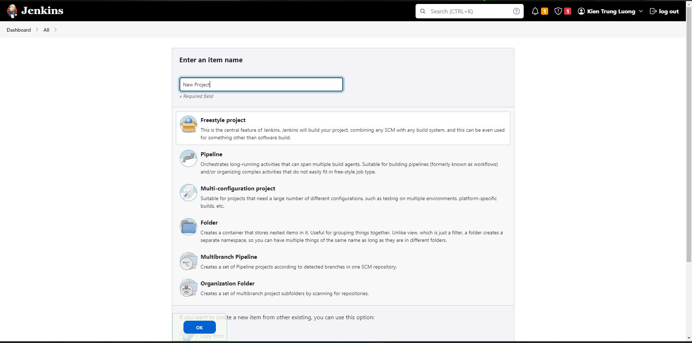
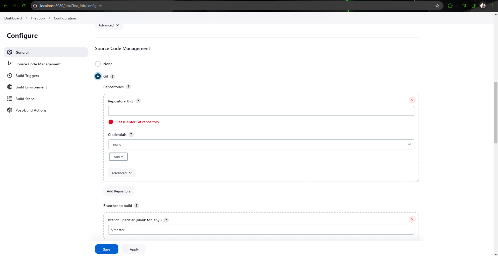
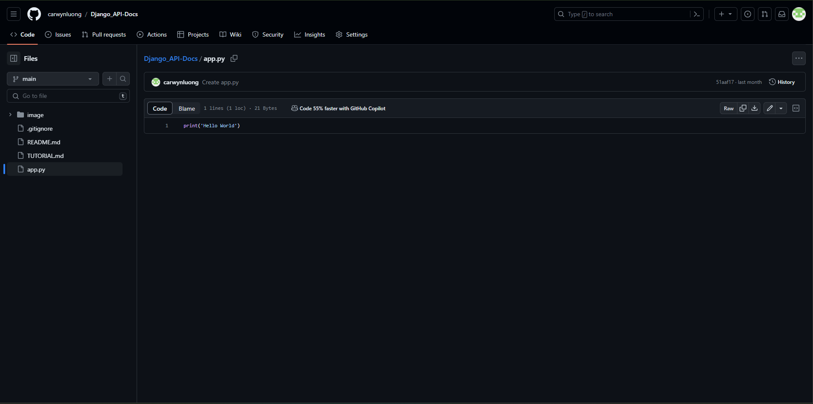
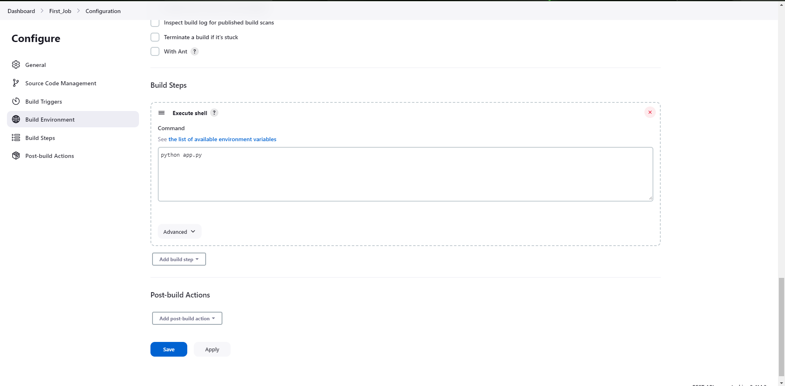
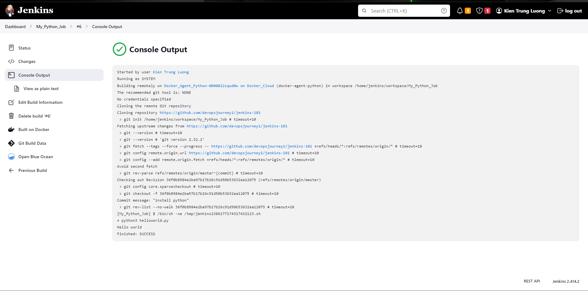

# New project

# Creat

> Create a name for project

> Add repo link 

> If repo is private, add access token in creadential

# Run

> I have a file app.py in repo 

> In Build  use "Execute Shell" and add script to run

# Result
